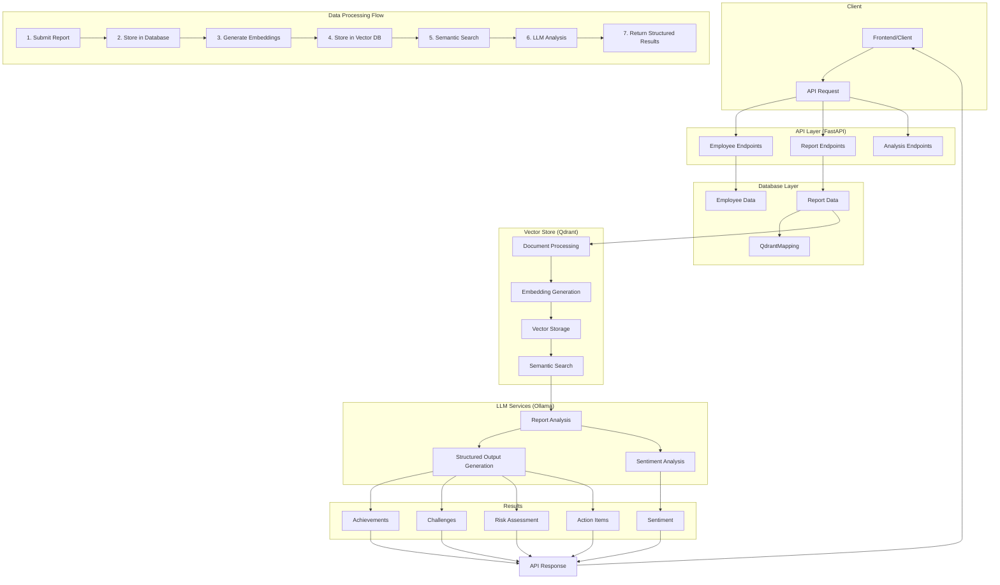

# Employee Report Analysis System Flow

## Detailed Process Flow

1. **Report Submission**
   - User submits employee report via API
   - System stores report in relational database (PostgreSQL/MSSQL)

2. **Vector Processing**
   - Report is chunked into smaller sections
   - Embedding vectors are generated for each chunk
   - Vectors are stored in Qdrant with metadata
   - Mappings between chunks and reports are stored in database

3. **Analysis Request**
   - User requests analysis for employee report(s)
   - System retrieves relevant report chunks using semantic search
   - Similar reports are identified for context

4. **LLM Processing**
   - Report and context are sent to Ollama LLM
   - LLM generates structured analysis with achievements, challenges, etc.
   - Results are formatted according to predefined schemas

5. **Result Delivery**
   - Structured analysis is returned to user via API
   - Results can include achievements, challenges, sentiment, risk levels, etc.
